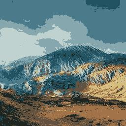

# k-means-compression
 
A from-scratch implementation of K-means clustering, used to compress images by reducing them to a small palette of colors. No `sklearn` in the core algorithm, every part of it (initialization, cluster assignment, centroid updates, convergence) is implemented by hand.

## Table of Contents
- [Example](#example)
- [How it works](#how-it-works)
- [Installation](#installation)
- [Usage](#usage)
    - [CLI](#cli)
    - [Web Interface](#web-interface)
- [Architecture](#architecture)
 
## Example
 
| Original | Compressed (k=4) |
|---|---|
|  |  |  

| Compressed (k=8) | Compressed (k=128) | 
|---|---|
|  |  |

| Original | Compressed (k=4) |
|---|---|
|  |  |

| Compressed (k=8) | Compressed (k=16) |
|---|---|
|  |  |

| Compressed (k=32) | Compressed (k=64) |
|---|---|
|  |  |


| Compressed (k=128) | Compressed (k=256) |
|---|---|
|  |  |

### Example output for `k=16`:
```
python3 cli.py -k 16 --load examples/cat.jpg --save examples/c
at-16.jpg
100%|████████████████████████| 100/100 [07:19<00:00,  4.39s/it]
Saved the compressed image to: examples/cat-16.jpg
Colors: 88,681 -> 16
Size: 65,744,640 bytes -> 10,957,488 bytes (83.3% smaller)
```
 
That 83.3% is theoretical: storing 16 RGB colors as a palette, plus a 4-bit index per pixel, instead of full 24-bit RGB per pixel. The real PNG files on disk compress even further, since PNG applies its own lossless compression on top.

## How it works
 
Every pixel is a point in 3D space (R, G, B). K-means clusters the image's pixels into K groups by color similarity, then replaces every pixel with its cluster's average color. Fewer distinct colors means the image can be stored far more compactly: a small color palette plus a per pixel index, instead of a full RGB triple for every pixel.
 
## Installation
 
```bash
git clone https://github.com/juliarzymowska/k-means-compression.git
cd k-means-compression
python3 -m venv .venv
source .venv/bin/activate   # or .venv\Scripts\activate on Windows
pip install -r requirements.txt
```
 
## Usage
A browser-based frontend is also available, alongside the CLI.

### CLI
 
```bash
python3 cli.py -k 16 --load photo.jpg --save compressed.png
```
 
| Flag | Description | Default |
|---|---|---|
| `-k` | Number of colors (1-256) | required |
| `--load` | Input image path | required |
| `--save` | Output image path | required |
| `--seed` | Random seed, for reproducible results | random |
| `--max_iter` | Max iterations before giving up | 100 |
| `--eps` | Convergence tolerance | 1e-4 |
| `--backend` | `scratch` (from-scratch, this project's implementation) or `sklearn` (fast path for large images / high K) | `scratch` |

> The `scratch` backend is the point of this project, but it's a pure Python/numpy implementation and can take a while on large images at high K! 

### Web Interface

- Terminal 1
```bash
cd web/backend && uvicorn main:app --reload
```
- Terminal 2
```bash
cd web/frontend && npm install && npm run dev
```

Then open the printed `localhost` URL, upload an image, set your options, and the compressed result displays once processing finishes.
Backend is on `localhost:8000` and frontend is on `localhost:5173`.
The before and after images are placed in `web/uploads` and `web/results`.
The web interface uses only `scratch` version of algorithm, so it might be slow for bigger images!

#### TODO
- [ ] add before and after image comparison
- [ ] update hero page

 
## Architecture
 ```bash
 .
├── examples
├── web
│   ├── backend
│   │   └── main.py
│   └── frontend
│       ├── public
│       ├── src
│       ├── index.html
│       ├── package.json
│       ├── package-lock.json
│       └── vite.config.js
├── cli.py
├── compressor.py
├── image_io.py
├── kmeans.py
├── kmeans_sklearn.py
├── README.md
├── requirements.txt
└── stats.py
 ```
- `kmeans.py` — the algorithm: initialization, cluster assignment (vectorized,
  batched to decrease memory usage on large images), centroid updates, and the main fit loop
- `kmeans_sklearn.py` — an alternative backend 
- `image_io.py` — loading images
- `compressor.py` — the pipeline that ties loading, clustering, and saving together
- `stats.py` — computes the compression statistics (unique colors, theoretical size,
  savings) shown after every run
- `cli.py` — the command-line interface and input validation
- `web/backend/main.py` - FastAPI backend for web interface 


### Tech Stack for web
- FastAPI - backend API, uses the same `pipeline()` as the CLI 
- Uvicorn - server that runs FastAPI
- Python-Multipart - required by FastAPI for handling file uploads
- Vite - frontend build tool and dev server 
- TailwindCss