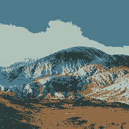
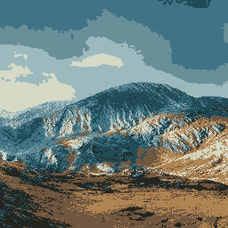
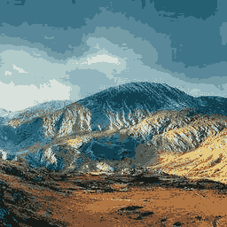
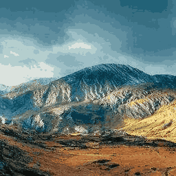
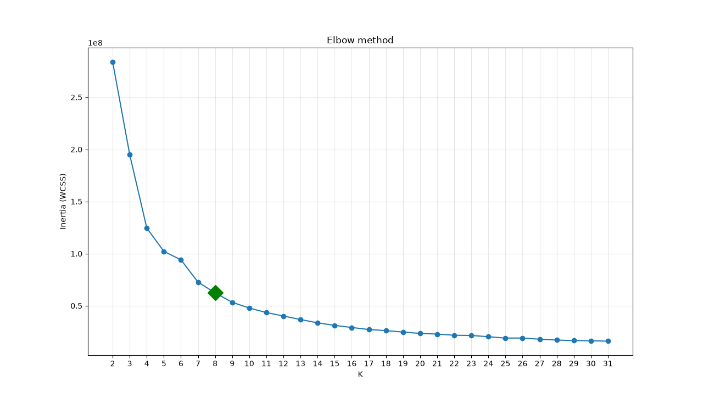

# k-means-compression
 
A from-scratch implementation of K-means clustering, used to compress images by reducing them to a small palette of colors. No `sklearn` in the core algorithm, every part of it (initialization, cluster assignment, centroid updates, convergence) is implemented by hand.

## Table of Contents
- [Example](#example)
- [How it works](#how-it-works)
- [Installation](#installation)
- [Usage](#usage)
    - [CLI](#cli)
    - [Elbow Method](#elbow-method)
    - [Web Interface](#web-interface)
- [Architecture](#architecture)
 
## Example
 
| Original | Compressed (k=4) |
|---|---|
|  |  |  

| Compressed (k=8) | Compressed (k=128) | 
|---|---|
|  |  |

| Original | Compressed (k=4) |
|---|---|
|  |  |

| Compressed (k=8) | Compressed (k=16) |
|---|---|
|  |  |

| Compressed (k=32) | Compressed (k=256) |
|---|---|
|  |  |


### Example output for `k=128` with `scratch` backend:
```sh
python3 cli.py -k 128 --load examples/cat.jpg --save examples/cat-128.jpg
 77%|█████████████████████████████████████▋           | 77/100 [35:41<10:39, 27.81s/it]
Saved the compressed image to: examples/cat-128.png
Colors: 88,681 -> 127
Size: 65,744,640 bytes -> 8,253,085 bytes (87.4% smaller)
```
 
The reported size is the real size of the saved PNG on disk (not a theoretical estimate), `original_size_bytes` is the raw, uncompressed 24-bit RGB baseline (`width * height * 3`), so the percentage shows how much smaller the actual compressed file is compared to that baseline.

## How it works
 
Every pixel is a point in 3D space (R, G, B). K-means clusters the image's pixels into K groups by color similarity, then replaces every pixel with its cluster's average color. Fewer distinct colors means the image can be stored far more compactly: a small color palette plus a per pixel index, instead of a full RGB triple for every pixel.
 
## Installation
 
```sh
git clone https://github.com/juliarzymowska/k-means-compression.git
cd k-means-compression
python3 -m venv .venv
source .venv/bin/activate   # or .venv\Scripts\activate on Windows
pip install -r requirements.txt
```
 
## Usage
A browser-based frontend is also available, alongside the CLI.

### CLI
 
```sh
python3 cli.py -k 16 --load photo.jpg --save compressed.png
```
 
| Flag | Description | Default |
|---|---|---|
| `-k` | Number of colors (1-256) | required |
| `--load` | Input image path | required |
| `--save` | Output image path | required |
| `--seed` | Random seed, for reproducible results | random |
| `--max_iter` | Max iterations before giving up | 100 |
| `--eps` | Convergence tolerance | 1e-4 |
| `-b` | Batch size for the k-means algorithm | 100,000 |
| `--backend` | `scratch` (from-scratch, this project's implementation) or `sklearn` (fast path for large images / high K) | `scratch` |

> The `scratch` backend is the point of this project, but it's a pure Python/numpy implementation and can take a while on large images at high K! 

### Elbow Method

Not sure what `k` to pick? The elbow method runs K-means for a range of `k` values, measures how compact each clustering is (WCSS - within-clusters sum of squares), and picks the `k` where adding more clusters stops giving much benefit - the "elbow" of the curve.


Run it from the project root:
```sh
python3 elbow.py --load photo.jpg --max_k 17 --seed 1
```

| Flag | Description | Default |
|---|---|---|
| `--load` | Input image path | required |
| `--max_k` | Maximum `k` to check (range checked is `2..max_k`, min. 3) | 17 |
| `--seed` | Random seed, for reproducible results | random |

It prints the optimal `k` and opens a plot of the WCSS curve with the chosen elbow marked. 

It uses only `scratch` backend option.

For a walkthrough of the math behind it (normalizing the curve, finding the point furthest from the line between its endpoints via Heron's formula), see [`notebooks/elbow_method.ipynb`](notebooks/elbow_method.ipynb).

#### Example output for `max_k=32`

```sh
python3 elbow.py --load examples/small-landscape.jpg --max_k 32
 10%|████▊                                           | 10/100 [00:00<00:00, 196.15it/s]
 50%|████████████████████████                        | 50/100 [00:00<00:00, 181.94it/s]
 17%|████████▏                                       | 17/100 [00:00<00:00, 158.41it/s]
 63%|██████████████████████████████▏                 | 63/100 [00:00<00:00, 144.98it/s]
 56%|██████████████████████████▉                     | 56/100 [00:00<00:00, 133.44it/s]
 70%|█████████████████████████████████▌              | 70/100 [00:00<00:00, 118.96it/s]
 45%|█████████████████████▌                          | 45/100 [00:00<00:00, 115.50it/s]
 54%|█████████████████████████▉                      | 54/100 [00:00<00:00, 107.24it/s]
100%|████████████████████████████████████████████████| 100/100 [00:01<00:00, 83.47it/s]
 74%|████████████████████████████████████▎            | 74/100 [00:01<00:00, 73.16it/s]
 61%|█████████████████████████████▉                   | 61/100 [00:00<00:00, 71.35it/s]
100%|████████████████████████████████████████████████| 100/100 [00:01<00:00, 70.78it/s]
 92%|█████████████████████████████████████████████    | 92/100 [00:01<00:00, 67.02it/s]
 73%|███████████████████████████████████▊             | 73/100 [00:01<00:00, 62.46it/s]
 83%|████████████████████████████████████████▋        | 83/100 [00:01<00:00, 59.19it/s]
100%|████████████████████████████████████████████████| 100/100 [00:01<00:00, 56.53it/s]
100%|████████████████████████████████████████████████| 100/100 [00:01<00:00, 56.09it/s]
100%|████████████████████████████████████████████████| 100/100 [00:01<00:00, 51.40it/s]
100%|████████████████████████████████████████████████| 100/100 [00:02<00:00, 49.37it/s]
100%|████████████████████████████████████████████████| 100/100 [00:02<00:00, 47.26it/s]
 91%|████████████████████████████████████████████▌    | 91/100 [00:02<00:00, 44.77it/s]
 92%|█████████████████████████████████████████████    | 92/100 [00:02<00:00, 42.23it/s]
100%|████████████████████████████████████████████████| 100/100 [00:02<00:00, 41.56it/s]
100%|████████████████████████████████████████████████| 100/100 [00:02<00:00, 40.82it/s]
100%|████████████████████████████████████████████████| 100/100 [00:02<00:00, 38.94it/s]
100%|████████████████████████████████████████████████| 100/100 [00:02<00:00, 34.95it/s]
100%|████████████████████████████████████████████████| 100/100 [00:02<00:00, 34.73it/s]
100%|████████████████████████████████████████████████| 100/100 [00:02<00:00, 33.69it/s]
100%|████████████████████████████████████████████████| 100/100 [00:03<00:00, 31.97it/s]
100%|████████████████████████████████████████████████| 100/100 [00:03<00:00, 28.75it/s]
Optimal k: 8
```
### Web Interface

- Terminal 1 (run from the project root)
```sh
uvicorn src.web.backend.main:app --reload
```
- Terminal 2
```sh
cd src/web/frontend && npm install && npm run dev
```

Then open the printed `localhost` URL. The page has two forms:
- **Compress** — upload an image, set `k` and the other options, and get back the compressed image.
- **Elbow method** — upload an image and a `max_k`, and get back a plot of the WCSS curve with the suggested `k` marked.

Backend is on `localhost:8000` and frontend is on `localhost:5173`.
Uploads and results are placed in `results/uploads`, `results/compressed`, and `results/elbow_method`.

https://github.com/user-attachments/assets/e77a3e92-7434-451a-84e5-60df38f950f0
 
## Architecture
 ```sh
 .
├── examples
├── notebooks
│   └── elbow_method.ipynb  # interactive walkthrough of the elbow method with visualizations
├── src
│   ├── web
│   │   ├── backend
│   │   │   └── main.py     # FastAPI backend for the web interface
│   │   └── frontend
│   │       ├── public
│   │       ├── src
│   │       ├── index.html
│   │       ├── package.json
│   │       ├── package-lock.json
│   │       └── vite.config.js
│   ├── compressor.py       # pipeline that ties loading, clustering, and saving together; computes the compression report
│   ├── error.py            # argument validation for cli.py and elbow.py
│   ├── image_io.py         # loading images
│   ├── kmeans.py           # from-scratch algorithm: init, cluster assignment, centroid updates, fit loop
│   └── kmeans_sklearn.py   # alternative backend using sklearn
├── cli.py                  # command-line interface for compressing an image
├── elbow.py                # elbow-method CLI for picking an optimal k
├── README.md
└── requirements.txt
 ```
### Tech Stack for web
- FastAPI - backend API, uses the same `pipeline()` as the CLI 
- Uvicorn - server that runs FastAPI
- Python-Multipart - required by FastAPI for handling file uploads
- Vite - frontend build tool and dev server 
- TailwindCSS
